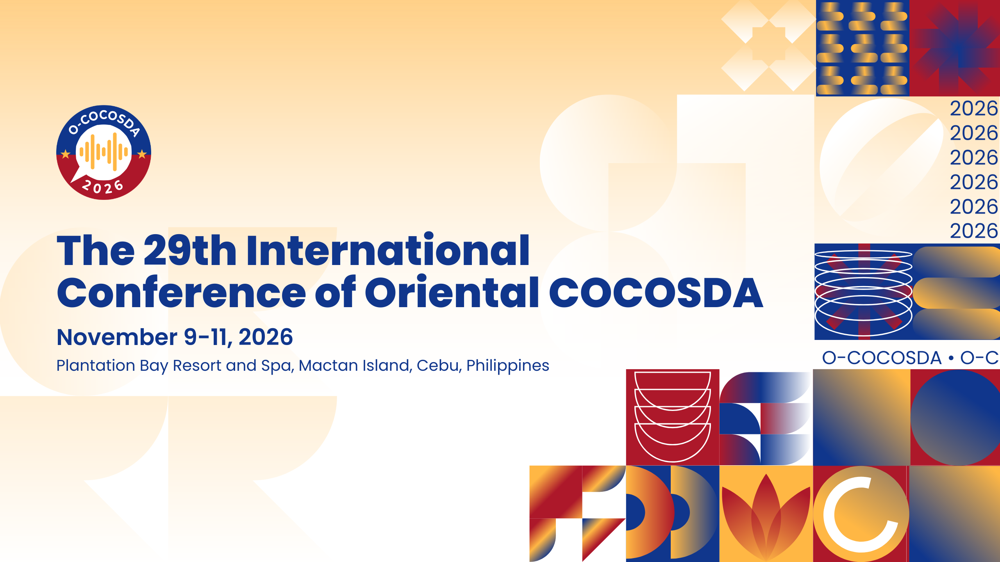

----

<h2 style="font-family: Verdana"><b>Call for Papers</b></h2>

 
<b>Oriental COCOSDA (O-COCOSDA)</b> is the Oriental branch of COCOSDA (the International Committee for the Coordination and Standardisation of Speech Databases and Assessment Techniques). Established in 1997, its primary goal is to foster the exchange of ideas, share insights, and address regional matters related to the creation, use, and distribution of spoken language corpora for Oriental languages. In addition, O-COCOSDA focuses on the assessment of speech recognition and synthesis systems, while promoting speech research in Oriental languages.

The first preparatory meeting took place in Hong Kong in 1997, and since then, 28 workshops have been hosted in various countries, including China, India, Indonesia, Japan, Korea, Macau, Malaysia, Myanmar, Nepal, the Philippines, Singapore, Taiwan, Thailand, and Vietnam. This year, the 29th edition of the conference returns to the Philippines and will be held on Mactan Island, Province of Cebu. It is jointly organized by the <b>De La Salle University College of Computer Studies - Advanced Research Institute for Informatics, Computing, and Networking (AdRIC)</b>, through its <b>Center for Language Technologies (CeLT)</b>, and <b>University of San Carlos Department of Computer, Information Sciences, and Mathematics</b>. O-COCOSDA 2026 is an <b>ISCA-supported event</b>, and the proceedings will be submitted for inclusion in the <b>ISCA Archive</b>.

Papers are invited on substantial, original, and unpublished research on all aspects of speech databases, assessments, and speech I/O, including, but not limited to:

- Speech databases and text corpora
- Assessment of spech input and output technologies
- Phonetic/phonological systems for oriental languages
- Romanization of non-roman characters
- Segmentation and labeling
- Speech prosody and labeling
- Speech processing models and systems
- Multilingual speech corpora
- Special topics on speech databases and assessments
- Standardization

----

## Important Dates

- **Paper Submission:** July 10, 2026
- **Acceptance Notification:** August 10, 2026
- **Camera Ready Deadline:** August 31, 2026

----

## Contact Information

### Angie Ceniza-Canillo

Chair, O-COCOSDA 2026  
Chair, Department of Computer, Information Sciences, and Mathematics, University of San Carlos  
amceniza@usc.edu.ph

### Nathaniel Oco

Chair, O-COCOSDA 2026  
Senior Lecturer, Department of Software Technology, College of Computer Studies, De La Salle University  
nathaniel.oco@dlsu.edu.ph

